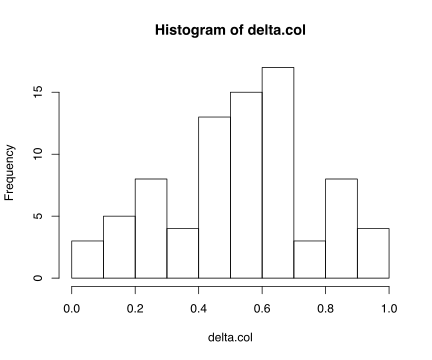

Finding the best models through a grid search
================

Needed packages.

``` r
library(tidyverse)
library(rstatix)
```

Bring in the data. Limiting to 1890-1989. Not requiring multiple works,
but requiring us\_national. Once this chunk is done executing, there
should be 5,573 books in d.

``` r
d <- read_tsv("../liwc/liwc_w_meta.tsv")

d <- d %>%
  filter(firstpub < 1990 & firstpub > 1889) %>% 
  filter(us_national == TRUE) %>%
  rename(author = hathi_author)
```

Now we convert the numeric columns for birthyear and firstpub into
factors. Six different factors are created for each numeric variable,
using different binwidths.

To avoid discarding data from the tails, we use a function that creates
ad-hoc breaks and requires each new factor level to have at least 20
books. So the breaks toward the end, and especially at the beginning of
birthyear, may be more widely spaced than in the middle of the timeline.

``` r
discretize <- function(numericvar, width) {
  minval = min(numericvar) - 1
  maxval = max(numericvar) + 1
  breaks = c()
  for (i in seq(minval, maxval, width)) {
    breaks <- c(breaks, i)
  }
  breaks <- c(breaks, maxval)
  
  neededbreaks = c(breaks[1])
  previous = breaks[1]
  for (idx in seq(2, length(breaks) - 1)) {
    prevct = sum(numericvar >= previous & numericvar < breaks[idx])
    nextct = sum(numericvar >= breaks[idx] & numericvar < breaks[idx + 1])
    if (prevct > 20 & nextct > 20 & breaks[idx] != 1989 ){
      previous = breaks[idx]
      neededbreaks <- c(neededbreaks, breaks[idx])
    }
  }
breaks <- c(neededbreaks, maxval)
print(breaks)
result <- cut(numericvar, breaks = as.integer(breaks), labels = as.character(breaks[1: length(breaks) -1]))
result
}

for (width in seq(4, 24, 4)){
  bylabel = paste('by_', as.character(width), sep = '')
  fplabel = paste('fp_', as.character(width), sep = '')
  d[bylabel] <- discretize(as.integer(d$birthyear), width)
  d[fplabel] <- discretize(as.integer(d$firstpub), width)
}
##  [1] 1808 1836 1840 1844 1848 1852 1856 1860 1864 1868 1872 1876 1880 1884
## [15] 1888 1892 1896 1900 1904 1908 1912 1916 1920 1924 1928 1932 1936 1940
## [29] 1944 1948 1952 1963
##  [1] 1889 1893 1897 1901 1905 1909 1913 1917 1921 1925 1929 1933 1937 1941
## [15] 1945 1949 1953 1957 1961 1965 1969 1973 1977 1981 1985 1990
##  [1] 1808 1832 1840 1848 1856 1864 1872 1880 1888 1896 1904 1912 1920 1928
## [15] 1936 1944 1952 1963
##  [1] 1889 1897 1905 1913 1921 1929 1937 1945 1953 1961 1969 1977 1985 1990
##  [1] 1808 1832 1844 1856 1868 1880 1892 1904 1916 1928 1940 1952 1963
##  [1] 1889 1901 1913 1925 1937 1949 1961 1973 1985 1990
##  [1] 1808 1840 1856 1872 1888 1904 1920 1936 1952 1963
## [1] 1889 1905 1921 1937 1953 1969 1985 1990
## [1] 1808 1848 1868 1888 1908 1928 1948 1963
## [1] 1889 1909 1929 1949 1969 1990
## [1] 1808 1832 1856 1880 1904 1928 1952 1963
## [1] 1889 1913 1937 1961 1985 1990
```

SCALE LIWC COLUMNS WITH BIZARRELY UNEVEN SCALES

All the dependent variables are converted to zscores, so they will have
comparable scales.

``` r
for (varnum in seq(10, 89)){
  d[ , varnum] <- scale(d[ , varnum])[, 1]
}
```

Now we actually do a grid search to find the best binwdiths for firstpub
and birthyear. We select the model with highest overall r2, and in doing
that use fivefold cross-validation *on unseen authors*.

After selecting the best model we find out how variance is apportioned
across variables.

``` r
chunk2 <- function(x,n) split(x, cut(seq_along(x), n, labels = FALSE)) 

r_squared <- function(vals, preds) {
  1 - (sum((vals - preds)^2) / sum((vals - mean(preds))^2))
}

cross_validate <- function(modelstring, data, depvar) {
  authors <- unique(d$author)
  authors <- sample(authors)
  fiveauthsets <- chunk2(authors, 5)
  rsquaredvals <- c()
  for (authset in fiveauthsets){
    dtest <- d[d$author %in% authset,  ]
    dtrain <- d[!d$author %in% authset,  ]
    model <- lm(as.formula(modelstring), data = dtrain)
    oos_predictions <- predict(model, newdata = dtest)
    r2 <- r_squared(dtest[depvar], oos_predictions)
    rsquaredvals <- c(rsquaredvals, r2)
  }
  mean(rsquaredvals)
}

varname.col <- c()
cmse.col <- c()
pmse.col <- c()
r2.col <- c()
delta.col <- c()
adjdelta.col <- c()
bywidth.col <- c()
fpwidth.col <- c()
bydf.col <- c()
fpdf.col <- c()

for (varnum in seq(10, 89)){
  depvar <- colnames(d)[varnum]
  if (depvar == 'function') next  # that word breaks my as.formula!     
  bestr2 <- -0.5
  bestmodel <- 'the unknown ideal'
  bestbywidth <- 50
  bestfpwidth <- 50
  
  for (bywidth in seq(4, 24, 4)) {
    for (fpwidth in seq(4, 24, 4)) {
      bylabel = paste('by_', as.character(bywidth), sep = '')
      fplabel = paste('fp_', as.character(fpwidth), sep = '')
      modelstring <- paste(depvar, '~', 'authorage + I(authorage^2) + ', bylabel, '+', fplabel)
      thisr2 <- cross_validate(modelstring, d, depvar)
      if (thisr2 > bestr2) {
        bestr2 <- thisr2
        bestmodel <- modelstring
        bestbywidth <- bywidth
        bestfpwidth <- fpwidth
      }
    }
  }
  model <- lm(as.formula(bestmodel), data = d)
  r2 <- summary(model)$r.squared
  at <- anova_test(model, detailed = TRUE)
  cmse <- at[3,2]
  cdf <- at[3,4]
  pmse <- at[4, 2]
  pdf <- at[4,4]
  delta <- cmse / (cmse + pmse)
  adjdelta = (cmse/cdf) / ((cmse/cdf) + (pmse / pdf))
  cat(depvar, bestbywidth, bestfpwidth, delta, adjdelta, bestr2, '\n')
  varname.col <- c(varname.col, depvar)
  cmse.col <- c(cmse.col, cmse)
  pmse.col <- c(pmse.col, pmse)
  r2.col <- c(r2.col, bestr2)
  delta.col <- c(delta.col, delta)
  adjdelta.col <- c(adjdelta.col, adjdelta)
  bywidth.col <- c(bywidth.col, bestbywidth)
  fpwidth.col <- c(fpwidth.col, bestfpwidth)
  bydf.col <- c(bydf.col, cdf)
  fpdf.col <- c(fpdf.col, pdf)
}
## Analytic 24 24 0.5464306 0.4454169 0.02215452 
## Clout 16 20 0.4348583 0.2778396 0.009445159 
## Authentic 12 12 0.3631732 0.293163 0.01892943 
## Tone 20 8 0.6338786 0.7759189 0.128963 
## WPS 24 20 0.5687051 0.4678208 0.002460615 
## Sixltr 16 4 0.3201651 0.5855499 0.009360323 
## Dic 24 24 0.3950294 0.3032889 0.02370028 
## was_function 24 16 0.3458359 0.3458359 0.01078058 
## pronoun 24 8 0.3804954 0.5512447 -0.0006751276 
## ppron 24 4 0.3136752 0.6464113 0.001200856 
## i 20 4 0.4474424 0.7640989 0.03639676 
## we 24 16 0.405102 0.405102 0.014499 
## you 8 24 0.9645729 0.8719057 0.0003943422 
## shehe 24 12 0.1619809 0.2049107 0.01226409 
## they 16 24 0.7874242 0.6493814 0.01362915 
## ipron 24 12 0.6875401 0.7457981 0.02052284 
## article 16 16 0.9375941 0.9184878 0.0178247 
## prep 16 16 0.5343579 0.4625618 0.05012678 
## auxverb 20 12 0.4015911 0.4722391 0.05721471 
## adverb 16 8 0.4130675 0.5135383 0.04087515 
## conj 20 20 0.7052392 0.6146516 0.02613217 
## negate 24 20 0.5024294 0.4023345 0.02705763 
## verb 20 20 0.4019703 0.3094424 0.05653592 
## adj 16 16 0.7343231 0.6745828 0.01833242 
## compare 24 24 0.8880029 0.840913 0.00453327 
## interrog 20 24 0.8288822 0.7635535 0.02642124 
## number 16 16 0.71632 0.6544365 0.01389588 
## quant 20 20 0.9002998 0.8575508 0.0351153 
## affect 12 12 0.869914 0.8294515 0.1086874 
## posemo 12 20 0.9844041 0.9582506 0.16799 
## negemo 20 8 0.3127277 0.4764548 0.01702791 
## anx 16 16 0.6543114 0.5867056 0.009911559 
## anger 24 8 0.3828063 0.5536658 0.04016583 
## sad 20 20 0.2956508 0.2186484 0.09651646 
## social 20 24 0.4128051 0.319114 0.00295496 
## family 20 20 0.6390025 0.5412987 0.01525128 
## friend 20 16 0.4020735 0.4020735 0.1123876 
## female 20 16 0.5490684 0.5490684 0.01148612 
## male 20 16 0.593143 0.593143 0.01428869 
## cogproc 24 12 0.6324577 0.6964515 0.03098651 
## insight 20 16 0.5184984 0.5184984 0.00766363 
## cause 24 12 0.5532188 0.6227805 0.05082884 
## discrep 20 16 0.5542664 0.5542664 0.03024496 
## tentat 16 12 0.5754218 0.5754218 0.03540158 
## certain 24 24 0.9606721 0.9421457 0.02981652 
## differ 16 8 0.5068276 0.6065367 0.0285035 
## percept 12 16 0.8510613 0.7570941 0.131437 
## see 24 4 0.308131 0.6404742 0.04500059 
## hear 12 24 0.8353859 0.6485539 0.1020351 
## feel 20 24 0.6894546 0.5967895 0.1075613 
## bio 20 12 0.3864943 0.4565126 0.1383789 
## body 20 16 0.6384735 0.6384735 0.1151494 
## health 24 16 0.4897252 0.4897252 0.02699592 
## sexual 20 4 0.1651142 0.4416759 0.1092072 
## ingest 24 20 0.3570066 0.2701532 0.07758642 
## drives 20 16 0.4092593 0.4092593 0.02991385 
## affiliation 20 20 0.658192 0.5621229 0.03113054 
## achieve 24 16 0.2844084 0.2844084 0.02000353 
## power 20 8 0.2735187 0.429548 0.005927461 
## reward 16 20 0.5812881 0.4097295 0.02135736 
## risk 20 12 0.3956632 0.4660806 0.03417901 
## focuspast 16 24 0.5312733 0.3617237 0.05597997 
## focuspresent 20 8 0.4431754 0.6141671 0.01574976 
## focusfuture 24 16 0.482241 0.482241 0.05207647 
## relativ 24 20 0.3898584 0.2987259 0.03404041 
## motion 16 16 0.3467827 0.2847758 0.03224912 
## space 16 24 0.5800286 0.4084791 0.06552769 
## time 16 8 0.560232 0.6564624 0.002431366 
## work 16 4 0.3897664 0.6570822 0.01343776 
## leisure 24 24 0.8904202 0.8441683 0.07505281 
## home 20 20 0.1905921 0.1356813 0.02624501 
## money 16 8 0.4529902 0.5540058 0.01439363 
## relig 20 8 0.3142078 0.4781707 0.004472276 
## death 20 24 0.6485882 0.5516586 0.0102238 
## informal 16 12 0.5964483 0.5964483 0.02158725 
## swear 12 4 0.3301251 0.5181269 0.2112415 
## netspeak 16 8 0.5484058 0.6455869 0.01308742 
## assent 24 16 0.6988555 0.6988555 0.008884729 
## nonflu 20 4 0.2302735 0.5447615 0.01675205 
## filler 16 20 0.4680298 0.3055084 0.07205623

res.df <- data.frame(depvar = varname.col, cmse = cmse.col, pmse = pmse.col, totalr2 = r2.col, delta = delta.col, adjdelta = adjdelta.col, bywidth = bywidth.col, fpwidth = fpwidth.col, bydf = bydf.col, fpdf = fpdf.col)
write.csv(res.df, file = 'crossvalidated_delta_knit.tsv', quote = FALSE, row.names = FALSE)
```

RESULTS:

    ## Mean delta is  0.53166
    ## If we adjust for df it is  0.54374
    ## The average r2 is  0.04062
    ## The weighted average, sum(cmse.col) / (sum(cmse.col) + sum(pmse.col)):
    ## 0.5228


