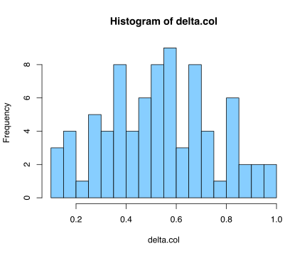

Finding the best models through a grid search
================

Needed packages.

``` r
library(tidyverse)
library(rstatix)
```

Bring in the data. Limiting to 1890-1989. Not requiring multiple works,
but requiring us\_national. Once this chunk is done executing, there
should be 5,573 books in d.

``` r
d <- read_tsv("../liwc/liwc_w_meta.tsv")

d <- d %>%
  filter(firstpub < 1990 & firstpub > 1889) %>% 
  filter(us_national == TRUE) %>%
  rename(author = hathi_author)
```

Now we convert the numeric columns for birthyear and firstpub into
factors. Six different factors are created for each numeric variable,
using different binwidths.

To avoid discarding data from the tails, we use a function that creates
ad-hoc breaks and requires each new factor level to have at least 20
books. So the breaks toward the end, and especially at the beginning of
birthyear, may be more widely spaced than in the middle of the timeline.

``` r
discretize <- function(numericvar, width) {
  minval = min(numericvar) - 1
  maxval = max(numericvar) + 1
  breaks = c()
  for (i in seq(minval, maxval, width)) {
    breaks <- c(breaks, i)
  }
  breaks <- c(breaks, maxval)
  
  neededbreaks = c(breaks[1])
  previous = breaks[1]
  for (idx in seq(2, length(breaks) - 1)) {
    prevct = sum(numericvar >= previous & numericvar < breaks[idx])
    nextct = sum(numericvar >= breaks[idx] & numericvar < breaks[idx + 1])
    if (prevct > 20 & nextct > 20 & breaks[idx] != 1989 ){
      previous = breaks[idx]
      neededbreaks <- c(neededbreaks, breaks[idx])
    }
  }
breaks <- c(neededbreaks, maxval)

# The algorithm above ensures that breaks are less tightly packed in tails of 
# distributions. But when the list of breaks gets quite short it can be
# tricky to arrange the breaks to compromise between even chronological
# spacing and (roughly!) even numbers of volumes in factor levels.
# The following cases are therefore addressed manually:

if (minval == 1889 & width == 24) breaks = c(1889, 1914, 1938, 1961, 1990)
if (minval == 1808 & width == 24) breaks = c(1808, 1854, 1878, 1902, 1926, 1990)
if (minval == 1808 & width == 20) breaks = c(1808, 1850, 1870, 1890, 1910, 1930, 1990)
if (minval == 1889 & width == 16) breaks = c(1889, 1905, 1921, 1937, 1953, 1968, 1982, 1990)

print(breaks)
result <- cut(numericvar, breaks = as.integer(breaks), labels = as.character(breaks[1: length(breaks) -1]))
result
}

for (width in seq(4, 24, 4)){
  bylabel = paste('by_', as.character(width), sep = '')
  fplabel = paste('fp_', as.character(width), sep = '')
  d[bylabel] <- discretize(as.integer(d$birthyear), width)
  d[fplabel] <- discretize(as.integer(d$firstpub), width)
}
##  [1] 1808 1836 1840 1844 1848 1852 1856 1860 1864 1868 1872 1876 1880 1884
## [15] 1888 1892 1896 1900 1904 1908 1912 1916 1920 1924 1928 1932 1936 1940
## [29] 1944 1948 1952 1963
##  [1] 1889 1893 1897 1901 1905 1909 1913 1917 1921 1925 1929 1933 1937 1941
## [15] 1945 1949 1953 1957 1961 1965 1969 1973 1977 1981 1985 1990
##  [1] 1808 1832 1840 1848 1856 1864 1872 1880 1888 1896 1904 1912 1920 1928
## [15] 1936 1944 1952 1963
##  [1] 1889 1897 1905 1913 1921 1929 1937 1945 1953 1961 1969 1977 1985 1990
##  [1] 1808 1832 1844 1856 1868 1880 1892 1904 1916 1928 1940 1952 1963
##  [1] 1889 1901 1913 1925 1937 1949 1961 1973 1985 1990
##  [1] 1808 1840 1856 1872 1888 1904 1920 1936 1952 1963
## [1] 1889 1905 1921 1937 1953 1968 1982 1990
## [1] 1808 1850 1870 1890 1910 1930 1990
## [1] 1889 1909 1929 1949 1969 1990
## [1] 1808 1854 1878 1902 1926 1990
## [1] 1889 1914 1938 1961 1990
```

SCALE LIWC COLUMNS WITH BIZARRELY UNEVEN SCALES

All the dependent variables are converted to zscores, so they will have
comparable scales.

``` r
for (varnum in seq(10, 89)){
  d[ , varnum] <- scale(d[ , varnum])[, 1]
}
```

Now we actually do a grid search to find the best binwdiths for firstpub
and birthyear. We select the model with highest overall r2, and in doing
that use fivefold cross-validation *on unseen authors*.

After selecting the best model we find out how variance is apportioned
across variables.

``` r
chunk2 <- function(x,n) split(x, cut(seq_along(x), n, labels = FALSE)) 

r_squared <- function(vals, preds) {
  1 - (sum((vals - preds)^2) / sum((vals - mean(preds))^2))
}

cross_validate <- function(modelstring, data, depvar) {
  
  # Testing a model specified by modelstring.
  # We test it on out-of-sample authors.
  
  authors <- unique(d$author)
  authors <- sample(authors)
  tenauthsets <- chunk2(authors, 10)
  rsquaredvals <- c()
  
  for (authset in tenauthsets){
    dtest <- d[d$author %in% authset,  ]
    dtrain <- d[!d$author %in% authset,  ]
    model <- lm(as.formula(modelstring), data = dtrain)
    oos_predictions <- predict(model, newdata = dtest)
    r2 <- r_squared(dtest[depvar], oos_predictions)
    rsquaredvals <- c(rsquaredvals, r2)
  }
  mean(rsquaredvals)
}

partial_r2s_oos <- function(modelstring, data, depvar, cohortvar, periodvar) {
  
  # See how much difference variables make out of sample.
  # Our strategy is to make predictions out of sample:
  # 1) using actual predictive variables
  # 2) with the cohort variable permuted
  # 3) with the period variable permuted
  #
  # The differences between 1 and 2 or 3 reflect lost predictive power.
  
  authors <- unique(d$author)
  authors <- sample(authors)
  tenauthsets <- chunk2(authors, 10)
  
  baseprediction <- c()
  predictionsanscohort <- c()
  predictionsansperiod <- c()
  correctyvals <- c()
  
  for (authset in tenauthsets){
    dtest <- d[d$author %in% authset,  ]
    dtrain <- d[!d$author %in% authset,  ]
    model <- lm(as.formula(modelstring), data = dtrain)
    oos_predictions <- predict(model, newdata = dtest)
    baseprediction <- c(baseprediction, oos_predictions)
    correctyvals <- c(correctyvals, dtest[depvar][[1]])
    
    cohortdata <- data.frame(dtest)
    cohortdata[cohortvar] <- sample(cohortdata[cohortvar][[1]])
    oos_predictions <- predict(model, newdata = cohortdata)
    predictionsanscohort <- c(predictionsanscohort, oos_predictions)
    
    perioddata <- data.frame(dtest)
    perioddata[periodvar] <- sample(perioddata[periodvar][[1]])
    oos_predictions <- predict(model, newdata = perioddata)
    predictionsansperiod <- c(predictionsansperiod, oos_predictions)
  }
  #cat(correctyvals, '\n')
  # cat(baseprediction, '\n')
  baser2 <- r_squared(correctyvals, baseprediction)
  sanscohortr2 <- r_squared(correctyvals, predictionsanscohort)
  sansperiodr2 <- r_squared(correctyvals, predictionsansperiod)
  
  returnvalue <- list(periodr2 = baser2 - sansperiodr2, cohortr2  = baser2 - sanscohortr2)
  returnvalue
}

periodnames = c('fp_4', 'fp_8', 'fp_12', 'fp_16', 'fp_20', 'fp_24')
cohortnames = c('by_4', 'by_8', 'by_12', 'by_16', 'by_20', 'by_24')

varname.col <- c()
cmse.col <- c()
pmse.col <- c()
r2.col <- c()
delta.col <- c()
adjdelta.col <- c()
bywidth.col <- c()
fpwidth.col <- c()
bydf.col <- c()
fpdf.col <- c()
pmse_oos.col <- c()
cmse_oos.col <- c()
delta_oos.col <- c()
r2_oos.col <- c()

# Iterate across dependent variables:

for (varnum in seq(10, 89)){
  depvar <- colnames(d)[varnum]
  if (depvar == 'function') next  # that word breaks my as.formula!     
  bestr2 <- -0.5
  bestmodel <- 'the unknown ideal'
  bestbywidth <- 50
  bestfpwidth <- 50
  
  # For each dependent variables, do a grid search to find the
  # granularity of factors that produce the highest r2.
  # This is assessed using the cross_validate function above,
  # which tests on out-of-sample authors.
  
  for (bywidth in seq(4, 24, 4)) {
    for (fpwidth in seq(4, 24, 4)) {
      
      bylabel = paste('by_', as.character(bywidth), sep = '')
      fplabel = paste('fp_', as.character(fpwidth), sep = '')
      modelstring <- paste(depvar, '~', 'authorage + I(authorage^2) + ', bylabel, '+', fplabel)
      thisr2 <- cross_validate(modelstring, d, depvar)
      
      if (thisr2 > bestr2) {
        bestr2 <- thisr2
        bestmodel <- modelstring
        bestbywidth <- bylabel
        bestfpwidth <- fplabel
      }
    }
  }
  
  # We're done finding the best model specification.
  # Now we train it on all data and examine sums of squares.
  
  r2_oos = bestr2
  variances_oos <- partial_r2s_oos(bestmodel, d, depvar, bestbywidth, bestfpwidth)
  
  cmse_oos = variances_oos$cohortr2
  pmse_oos = variances_oos$periodr2
  
  if (cmse_oos < 0) cmse_oos = .00000001    # debatable choice here
  if (pmse_oos < 0) pmse_oos = .00000001
  
  model <- lm(as.formula(bestmodel), data = d)
  thisr2 <- summary(model)$r.squared
  at <- anova_test(model, detailed = TRUE)
  
  cmse = 0
  pmse = 0
  cdf = 0
  pdf = 0
  
  for (rownum in seq(3, dim(at)[1])) {
    variable_name = at[rownum, 1]
    if (variable_name %in% cohortnames){
      cmse = cmse + at[rownum, 2]
      cdf = cdf + at[rownum, 4]
    }
    else if (variable_name %in% periodnames) {
      pmse = pmse + at[rownum, 2]
      pdf = pdf + at[rownum, 4]
    }
    else {
      print('Model error.')
    }
  }
  
  delta <- cmse / (cmse + pmse)
  delta_oos <- cmse_oos / (cmse_oos + pmse_oos)
  adjdelta = (cmse/cdf) / ((cmse/cdf) + (pmse / pdf))
  cat(depvar, bestbywidth, bestfpwidth, delta, adjdelta, thisr2, '\n')
  varname.col <- c(varname.col, depvar)
  cmse.col <- c(cmse.col, cmse)
  pmse.col <- c(pmse.col, pmse)
  pmse_oos.col <- c(pmse_oos.col, pmse_oos)
  cmse_oos.col <- c(cmse_oos.col, cmse_oos)
  delta_oos.col <- c(delta_oos.col, delta_oos)
  r2.col <- c(r2.col, thisr2)
  r2_oos.col <- c(r2_oos.col, r2_oos)
  delta.col <- c(delta.col, delta)
  adjdelta.col <- c(adjdelta.col, adjdelta)
  bywidth.col <- c(bywidth.col, bestbywidth)
  fpwidth.col <- c(fpwidth.col, bestfpwidth)
  bydf.col <- c(bydf.col, cdf)
  fpdf.col <- c(fpdf.col, pdf)
}
## Analytic by_20 fp_16 0.764659 0.795876 0.03284901 
## Clout by_20 fp_16 0.4681484 0.5136822 0.020758 
## Authentic by_20 fp_16 0.1936713 0.2237392 0.02904634 
## Tone by_12 fp_24 0.9873498 0.9551296 0.1475577 
## WPS by_20 fp_20 0.6397778 0.5869222 0.008909021 
## Sixltr by_20 fp_8 0.4639579 0.6750356 0.03234831 
## Dic by_20 fp_20 0.5324906 0.4767673 0.03412572 
## was_function by_24 fp_20 0.4044844 0.4044844 0.01996488 
## pronoun by_24 fp_8 0.4528954 0.7129252 0.01866339 
## ppron by_24 fp_8 0.3986614 0.6654254 0.02005114 
## i by_20 fp_24 0.7338844 0.6233038 0.04329372 
## we by_20 fp_24 0.4425482 0.322643 0.0209021 
## you by_20 fp_20 0.811188 0.7746234 0.02231925 
## shehe by_24 fp_24 0.1054773 0.08125047 0.02049318 
## they by_16 fp_12 0.5157476 0.5157476 0.02708019 
## ipron by_20 fp_16 0.9134422 0.9268127 0.03431436 
## article by_20 fp_24 0.1979 0.1289475 0.0239536 
## prep by_20 fp_16 0.5958953 0.6389276 0.06782346 
## auxverb by_24 fp_24 0.7270885 0.6664603 0.06544314 
## adverb by_16 fp_24 0.59183 0.3522204 0.05390712 
## conj by_20 fp_12 0.6627126 0.7586715 0.03772935 
## negate by_20 fp_16 0.3911962 0.4353722 0.04017682 
## verb by_20 fp_4 0.4086244 0.7683399 0.07885239 
## adj by_24 fp_8 0.6806649 0.8647647 0.03735482 
## compare by_16 fp_12 0.7365184 0.7365184 0.02112687 
## interrog by_20 fp_20 0.8389646 0.806496 0.0457911 
## number by_16 fp_24 0.821529 0.6331866 0.02676859 
## quant by_24 fp_16 0.3403436 0.4362739 0.04359937 
## affect by_24 fp_16 0.1438491 0.2012956 0.1141188 
## posemo by_12 fp_8 0.8426022 0.8538011 0.184851 
## negemo by_20 fp_20 0.4741982 0.4191065 0.02744558 
## anx by_20 fp_8 0.1485435 0.2951291 0.02371706 
## anger by_20 fp_12 0.6554866 0.7527342 0.05470205 
## sad by_16 fp_16 0.3372232 0.2762029 0.1026876 
## social by_20 fp_20 0.52375 0.4680257 0.01565063 
## family by_24 fp_16 0.5322721 0.6305864 0.01958677 
## friend by_20 fp_12 0.3953367 0.5112655 0.1180937 
## female by_24 fp_16 0.2619749 0.3474507 0.02044722 
## male by_12 fp_20 0.8327161 0.6441448 0.02770723 
## cogproc by_16 fp_20 0.8372848 0.7201117 0.04169257 
## insight by_20 fp_12 0.563976 0.6742164 0.02218919 
## cause by_24 fp_16 0.4793865 0.5800465 0.05800575 
## discrep by_24 fp_24 0.5008953 0.4294487 0.0393135 
## tentat by_20 fp_24 0.5801007 0.4532275 0.0459286 
## certain by_12 fp_24 0.9642832 0.880427 0.04920978 
## differ by_16 fp_16 0.6165888 0.5467164 0.04224785 
## percept by_12 fp_20 0.8510142 0.6750197 0.1532687 
## see by_20 fp_8 0.5783697 0.7670188 0.06181422 
## hear by_20 fp_12 0.672359 0.7665402 0.1174244 
## feel by_20 fp_12 0.5892665 0.6965532 0.1192195 
## bio by_24 fp_16 0.256478 0.3409889 0.1482167 
## body by_20 fp_24 0.8555278 0.7803669 0.1261985 
## health by_12 fp_20 0.7424163 0.511739 0.03242616 
## sexual by_20 fp_16 0.2341329 0.2683916 0.1129825 
## ingest by_20 fp_16 0.5751354 0.6189647 0.0849629 
## drives by_20 fp_16 0.3874002 0.4314514 0.04170832 
## affiliation by_20 fp_20 0.6756517 0.6249744 0.0372291 
## achieve by_24 fp_20 0.3673807 0.3673807 0.02880319 
## power by_20 fp_12 0.3065925 0.4143298 0.01857073 
## reward by_24 fp_20 0.2895897 0.2895897 0.02494999 
## risk by_20 fp_12 0.361661 0.47548 0.04935081 
## focuspast by_20 fp_12 0.5712613 0.6807027 0.07119626 
## focuspresent by_20 fp_8 0.6680208 0.8284548 0.0403642 
## focusfuture by_12 fp_12 0.6198644 0.5425267 0.07331195 
## relativ by_20 fp_8 0.3382006 0.5508598 0.05065021 
## motion by_20 fp_16 0.5120543 0.5573831 0.04556267 
## space by_20 fp_20 0.5326851 0.4769622 0.07695712 
## time by_16 fp_4 0.470918 0.7275352 0.02334083 
## work by_20 fp_16 0.6670056 0.706199 0.0259764 
## leisure by_20 fp_16 0.1533029 0.1784909 0.07973989 
## home by_24 fp_20 0.3703577 0.3703577 0.04212497 
## money by_12 fp_8 0.596035 0.6167988 0.0288058 
## relig by_20 fp_8 0.1512359 0.2995436 0.01545806 
## death by_16 fp_20 0.6808403 0.5161167 0.02071486 
## informal by_20 fp_8 0.3965969 0.6120182 0.02913271 
## swear by_20 fp_8 0.2990817 0.5059482 0.2183817 
## netspeak by_20 fp_24 0.2950524 0.2007207 0.01934988 
## assent by_16 fp_20 0.9191875 0.8504598 0.01930351 
## nonflu by_20 fp_12 0.5201297 0.6342669 0.03124104 
## filler by_20 fp_20 0.4444608 0.3902597 0.08112926

res.df <- data.frame(depvar = varname.col, cmse = cmse.col, pmse = pmse.col, totalr2 = r2.col, delta = delta.col, adjdelta = adjdelta.col, bywidth = bywidth.col, fpwidth = fpwidth.col, bydf = bydf.col, fpdf = fpdf.col, pmse_oos = pmse_oos.col, cmse_oos = cmse_oos.col, delta_oos = delta_oos.col, r2_oos = r2_oos.col)
write.csv(res.df, file = 'gridsearch_delta_oos.csv', quote = FALSE, row.names = FALSE)
```

RESULTS:

    ## Mean delta is  0.53077
    ## If we adjust for df it is  0.55549
    ## The average r2 is  0.05291
    ## The weighted average, sum(cmse.col) / (sum(cmse.col) + sum(pmse.col)):
    ## 0.54384
    ## 
    ## Mean delta measured oos is  0.45718
    ## but as a weighted average it is: 0.52912


