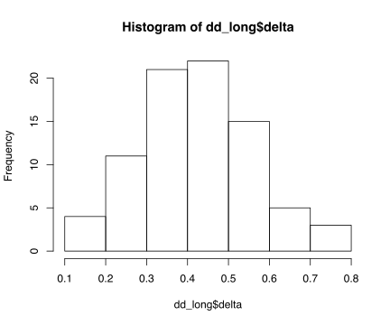
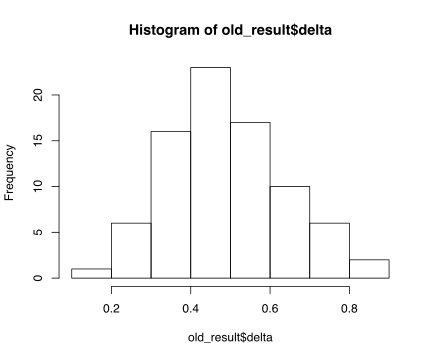

Preliminary analysis
================

``` r
knitr::opts_chunk$set(echo = TRUE, 
                      message = FALSE,
                      warning = FALSE,
                      collapse = TRUE,
                      fig.retina = 2, # Control using dpi
                      fig.width = 6,  # generated images
                      fig.pos = "t",  # pdf mode
                      fig.align = "center", 
                      out.width = "100%",
                      dev = "svg")
```

``` r
library(tidyverse)
```

Bring in the data. Limiting to 1890-1989. Not requiring multiple works,
but requiring us\_national. Once this chunk is done executing, there
should be 5,573 books in d.

``` r
d <- read_tsv("../liwc/liwc_w_meta.tsv")

d <- d %>%
  filter(firstpub < 1990 & firstpub > 1889) %>% 
  filter(us_national == TRUE) %>%   # this is changed
  rename(author = hathi_author)
```

``` r
cwidth <- 10
pwidth <- 10

dd <- d %>% 
 mutate(cohort = floor((birthyear-1825)/cwidth)*cwidth + 1825,
        year = floor(firstpub/pwidth)*pwidth) %>% 
  group_by(cohort) %>% 
  add_tally()
```

FE ANOVA

``` r
library(rstatix)

width <- 10

dd <- d %>% 
 mutate(cohort = floor((birthyear-1825)/width)*width + 1825,
        year = floor(firstpub/width)*width,
        age = authorage - 45) %>% 
  group_by(author) %>% 
  add_tally() %>% 
  mutate(mage = mean(age)) %>%   # need later
  ungroup() %>% 
  mutate(weight = 1 / (n / (nrow(dd) / n_distinct(dd$author))))

m1 <- lm(sexual ~ age + I(age^2) + factor(cohort) + factor(year) + mage,
         weight = weight,
         data = dd)
at <- anova_test(m1, detailed = TRUE)

C_mse <- at[3,2] / at[3,4]
P_mse <- at[4,2] / at[4,4]

C_mse / (C_mse + P_mse)
## [1] 0.3277311
```

Iterate\! Decide whether or not to include `mage`. Doesn’t seem to
matter much though it technically means we’re only using w/in author
variance to estimate age curve. This is probably good.

``` r

my_fit <- function(df) {
  lm(value ~ age + I(age^2) + factor(cohort) + factor(year) + mage, 
     data = df,
     weight = weight)
}

my_vc <- function(model) {
  
  at <- anova_test(model, detailed = TRUE)
  
  C_mse <- at[3,2] / at[3,4]
  P_mse <- at[4,2] / at[4,4]

  C_mse / (C_mse + P_mse)
  
}

get_cmse <- function(model) {
  
  at <- anova_test(model, detailed = TRUE)
  C_mse <- at[3,2] / at[3,4]
  C_mse 
}

get_pmse <- function(model) {
  at <- anova_test(model, detailed = TRUE)
  P_mse <- at[4,2] / at[4,4]
  P_mse
}

# not ideal to run the model three times!
# but I don't know tidyverse well enough to
# know how to map back multiple results from
# one function call

dd_long <- dd %>% 
  pivot_longer(cols = WC:filler) %>% 
  group_by(name) %>% 
  nest() %>% 
  mutate(model = map(data, my_fit),
         delta = map(model, my_vc),
         cmse = map(model, get_cmse),
         pmse = map(model, get_pmse)) %>% 
  select(name, delta, cmse, pmse) %>% 
  mutate(delta = as.numeric(delta)) %>%
  mutate(cmse = as.numeric(cmse)) %>%
  mutate(pmse = as.numeric(pmse)) %>%
  arrange(delta)
```

``` r
print("Current model: use all books, down-weight prolific authors:")
## [1] "Current model: use all books, down-weight prolific authors:"
cat('Raw average delta:', mean(dd_long$delta), '\n')
## Raw average delta: 0.4228707
weighted_avg <- sum(dd_long$cmse / (sum(dd_long$cmse) + sum(dd_long$pmse)))
cat('Delta calculated by summing total r2:', weighted_avg, '\n')
## Delta calculated by summing total r2: 0.4318599
```

Visualize
distribution

``` r
hist(dd_long$delta)
```



``` r

# modifying the function so it doesn't use the weights,
# and treats all books equally

older_fit <- function(df) {
  lm(value ~ age + I(age^2) + factor(cohort) + factor(year) + mage, 
     data = df)  # no weight
}

my_vc <- function(model) {
  
  at <- anova_test(model, detailed = TRUE)
  
  C_mse <- at[3,2] / at[3,4]
  P_mse <- at[4,2] / at[4,4]

  C_mse / (C_mse + P_mse)
  
}

get_cmse <- function(model) {
  
  at <- anova_test(model, detailed = TRUE)
  C_mse <- at[3,2] / at[3,4]
  C_mse 
}

get_pmse <- function(model) {
  at <- anova_test(model, detailed = TRUE)
  P_mse <- at[4,2] / at[4,4]
  P_mse
}

old_result <- dd %>% 
  pivot_longer(cols = WC:filler) %>% 
  group_by(name) %>% 
  nest() %>% 
  mutate(model = map(data, older_fit),
         delta = map(model, my_vc),
         cmse = map(model, get_cmse),
         pmse = map(model, get_pmse)) %>% 
  select(name, delta, cmse, pmse) %>% 
  mutate(delta = as.numeric(delta)) %>%
  mutate(cmse = as.numeric(cmse)) %>%
  mutate(pmse = as.numeric(pmse)) %>%
  arrange(delta)
```

``` r
print("If we use all books, and don't down-weight prolific authors:")
## [1] "If we use all books, and don't down-weight prolific authors:"
cat('Raw average of delta:', mean(old_result$delta), '\n')
## Raw average of delta: 0.491501
weighted_avg <- sum(old_result$cmse / (sum(old_result$cmse) + sum(old_result$pmse)))
cat('Weighted average of delta:', weighted_avg, '\n')
## Weighted average of delta: 0.2685063
```

``` r
hist(old_result$delta)
```



``` r
rows <- sample(nrow(dd))
shuffled_dd <- dd[rows, ]   # shuffling the data frame because otherwise
                            # we get *first* book for each author
one_per_author <- shuffled_dd[!duplicated(shuffled_dd$author),]

one_per_results <- one_per_author %>% 
  pivot_longer(cols = WC:filler) %>% 
  group_by(name) %>% 
  nest() %>% 
  mutate(model = map(data, my_fit),
         delta = map(model, my_vc),
         cmse = map(model, get_cmse),
         pmse = map(model, get_pmse)) %>% 
  select(name, delta, cmse, pmse) %>% 
  mutate(delta = as.numeric(delta)) %>%
  mutate(cmse = as.numeric(cmse)) %>%
  mutate(pmse = as.numeric(pmse)) %>%
  arrange(delta)
```

``` r
print('If we use only one book per author:')
## [1] "If we use only one book per author:"
cat('Raw average of delta:', mean(one_per_results$delta), '\n')
## Raw average of delta: 0.4256638
weighted_avg <- sum(one_per_results$cmse / (sum(one_per_results$cmse) + sum(one_per_results$pmse)))
cat('Weighted average of delta:', weighted_avg, '\n')
## Weighted average of delta: 0.3095497
```
