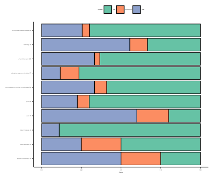

sem-analysis
================
Kevin Kiley
7/22/2021

Load in required packages:

``` r
library(lavaan)
library(broom)
```

## Data Cleaning

Load in data and scale all topic proportions.

``` r
book <- read.csv('../topicdata/bookleveltopicdata.tsv', sep = '\t')

for (varnum in seq(1, 200)){
  book[ , varnum] <- scale(book[ , varnum])[, 1]
}
```

Filtering to just authors between 1889 and 1990 with at least 3 books
and U.S. nationals. 784 unique authors with 5,060 works (1.45 books per
author). I wish there were more.

``` r
multi.book <- book %>%
  filter(firstpub < 1990 & firstpub > 1889) %>%
  group_by(hathi_author) %>% 
  filter(n() >= 3) %>%
  arrange(hathi_author, firstpub) %>%
  filter(us_national == "True")
```

Arrange data into “triples,” sets of three books by the same author in
chronological order. If an author wrote four books, they will have two
triples (books 1, 2, and 3; books 2, 3, and 4). I don’t know if this is
the best approach, but it’s what I have at the moment. We might want to
think about weighting by the number of triples an author has in the data
set.

``` r
multi.book.long <- multi.book %>% 
  select(hathi_author, firstpub, birthyear, t0:t199) %>%
  pivot_longer(t0:t199, names_to = "topic", values_to = "y") %>% 
  group_by(hathi_author, topic) %>%
  mutate(y1 = lag(y, 2),
         y2 = lag(y, 1),
         y3 = y,
         d1 = lag(firstpub, 2),
         d2 = lag(firstpub, 1),
         d3 = firstpub,
         time12 = d2 - d1, 
         time23 = d3 - d2) %>%
  select(-c(y, firstpub)) %>%
  filter(!is.na(y1), !is.na(y2)) %>%
  drop_na() %>% 
  group_by(topic) %>%
  mutate(age = d1 - birthyear) %>% 
  group_by(hathi_author, topic) %>% mutate(triples = n()) %>%
  mutate(w = 1/triples)
```

I’ve added a weighting term (`w`) that’s simply one divided by the
number of triples for that author. This really affects results later.

## SEM Functions

Below I express the syntax for four active updating models and two
settled dispositions model (and one confirmatory factor analysis), as
outlined in Vaisey and Kiley (2021). I’m going to compare which of these
models best fits the data using BIC.

``` r
#SEM syntax
aum1_mod <- "

  # structural part 
    y3 ~ alpha*1 + rho*y2 
    y2 ~ alpha*1 + rho*y1
    
  # measurement part
    U =~ 1*y3 + 1*y2

  # variances
    y3 ~~ v*y3
    y2 ~~ v*y2
    
  # covariance (constrained)
    U ~~ 0*y1
    
  # constraint var(U) = 0
    U ~~ 0*U
    
"

## AUM2
aum2_mod <- "

  # structural part 
    y3 ~ alpha3*1 + rho*y2 
    y2 ~ alpha2*1 + rho*y1
    
  # measurement part
    U =~ 1*y3 + 1*y2

  # variances
    y3 ~~ v*y3
    y2 ~~ v*y2
    
  # covariance (constrained)
    U ~~ 0*y1
    
  # constraint var(U) = 0
    U ~~ 0*U
    
"

## AUM3
aum3_mod <- "

  # structural part 
    y3 ~ alpha*1 + rho*y2 
    y2 ~ alpha*1 + rho*y1
    
  # measurement part
    U =~ 1*y3 + 1*y2

  # variances
    y3 ~~ v*y3
    y2 ~~ v*y2
    
  # covariance
    U ~~ tau*y1
    
  # var(U)
    U ~~ U
  
"

## AUM4
aum4_mod <- "

  # structural part 
    y3 ~ alpha3*1 + rho*y2 
    y2 ~ alpha2*1 + rho*y1
    
  # measurement part
    U =~ 1*y3 + 1*y2

  # variances
    y3 ~~ v*y3
    y2 ~~ v*y2
    
  # covariance (tau)
    U ~~ tau*y1
    
  # var(U)
    U ~~ U
  
"

## SDM1
sdm1_mod <- "

  # structural part 
    y3 ~ alpha*1 + rho*y2 
    y2 ~ alpha*1 + rho*y1
    
  # measurement part
    U =~ 1*y3 + 1*y2

  # variances
    y3 ~~ v*y3
    y2 ~~ v*y2
    
  # covariance (tau)
    U ~~ tau*y1
    
  # var(U)
    U ~~ U
    
  # constraint
    rho == 0
  
"

## SDM2
sdm2_mod <- "

  # structural part 
    y3 ~ alpha3*1 + rho*y2 
    y2 ~ alpha2*1 + rho*y1
    
  # measurement part
    U =~ 1*y3 + 1*y2

  # variances
    y3 ~~ v*y3
    y2 ~~ v*y2
    
  # covariance (tau)
    U ~~ tau*y1
    
  # var(U)
    U ~~ U
    
  # constraint
    rho == 0
  
"

## CFA
cfa_mod <- "

  # measurement part
    U =~ 1*y3 + 1*y2 + 1*y1

  # variances
    y3 ~~ v*y3
    y2 ~~ v*y2
    y1 ~~ v*y1
    
  # var(U)
    U ~~ U

  # intercepts
    y1 ~ int*1
    y2 ~ int*1
    y3 ~ int*1

"

# fitting functions
aum1_fit <- function (x) {
  sem(aum1_mod,
      check.post = TRUE,
      se = "none",
      sampling.weights = "w", #note weighting term
      data = x)
}

aum2_fit <- function (x) {
  sem(aum2_mod,
      check.post = TRUE,
      se = "none",
      sampling.weights = "w",
      data = x)
}

aum3_fit <- function (x) {
  sem(aum3_mod,
      check.post = TRUE,
      sampling.weights = "w",
      se = "none",
      data = x)
}

aum4_fit <- function (x) {
  sem(aum4_mod,
      check.post = TRUE,
      sampling.weights = "w",
      se = "none",
      data = x)
}

sdm1_fit <- function (x) {
  sem(sdm1_mod,
      check.post = TRUE,
      sampling.weights = "w",
      se = "none",
      data = x)
}

sdm2_fit <- function (x) {
  sem(sdm2_mod,
      check.post = TRUE,
      sampling.weights = "w",
      se = "none",
      data = x)
}

cfa_fit <- function (x) {
  sem(cfa_mod,
      check.post = TRUE,
      sampling.weights = "w",
      se = "none",
      data = x)
}

p_aum1_fit <- possibly(aum1_fit, otherwise = "NOPE")
p_aum2_fit <- possibly(aum2_fit, otherwise = "NOPE")
p_aum3_fit <- possibly(aum3_fit, otherwise = "NOPE")
p_aum4_fit <- possibly(aum4_fit, otherwise = "NOPE")
p_sdm1_fit <- possibly(sdm1_fit, otherwise = "NOPE")
p_sdm2_fit <- possibly(sdm2_fit, otherwise = "NOPE")
p_cfa_fit <- possibly(cfa_fit, otherwise = "NOPE")
```

## Running the Models

I fit all six models to the data and calculate the BIC. I then pick the
best-fitting active updating model and the best fitting settled
disposition model and compare them. I pick the best fitting model based
on lowest BIC. If the BIC difference is less than 2, the result is
deemed “inconclusive.”

``` r
#Running the models
multi.book.long.sem <- multi.book.long %>% 
  group_by(topic) %>% nest() %>%
  mutate(AUM1 = map(data, p_aum1_fit),
         AUM2 = map(data, p_aum2_fit),
         AUM3 = map(data, p_aum3_fit),
         AUM4 = map(data, p_aum4_fit),
         SDM1 = map(data, p_sdm1_fit),
         SDM2 = map(data, p_sdm2_fit),
         CFA = map(data, p_cfa_fit))

p_glance = possibly(glance, otherwise = "NOPE")

results <- multi.book.long.sem %>%
  pivot_longer(AUM1:CFA, names_to = "mod_spec", values_to = "mod_object") %>% 
  mutate(glanced = map(mod_object, p_glance)) %>% 
  unnest(glanced) %>% 
  select(topic, mod_spec, BIC, chisq, npar, rmsea, converged, nobs) %>% 
  mutate(type = case_when(
    mod_spec == "SDM1" | mod_spec == "SDM2" ~ "SDM",
    mod_spec == "CFA" ~ "CFA",
    TRUE ~ "AUM")) %>% 
  ungroup()

#Determine best fit of each, then overall best fit
winners <- results %>%
  filter(type != "CFA") %>% 
  group_by(topic, type) %>% 
  filter(BIC == min(BIC)) %>% 
  group_by(topic) %>% 
  mutate(BIC_diff = BIC - max(BIC)) %>% 
  filter(BIC == min(BIC)) %>% 
  mutate(verdict = if_else(BIC_diff >= -2, "Inconclusive", type)) %>% 
  ungroup()
```

## Results

Count of number of topics in each class.

``` r
table(winners$verdict)
## 
##          AUM Inconclusive          SDM 
##          112           19           69
```

Graph proportion of AUM, SDM, and Inconclusive in each topic category.
Really different. Much more
AUM.

``` r
topic.cats <- read.csv('../topicdata/k200standardcoding.tsv', sep = '\t')

winners %>%
  mutate(category = topic.cats$category) %>%
  group_by(category, verdict) %>% summarise(count = n()) %>%
  mutate(pct = count/sum(count), total_count = sum(count),
         category = paste(category, " (", total_count, ")", sep = "")) %>%
  ggplot(aes(x = category, y = pct, fill = verdict)) + 
  geom_bar(stat = "identity", color = "black") + 
  coord_flip() + 
  theme_classic() + 
  theme(legend.position = "top") + 
  labs(x = "", y = "Count", fill = "Models:") + 
  scale_fill_brewer(type = "qual", palette = "Set2")
```



``` r

library(haven)
write_csv(results, path = "sem_topic_results.csv") #results for all models for all topics
write_csv(winners, path = "sem_topic_preferred.csv") #verdict (pref. model) for all topics
```
